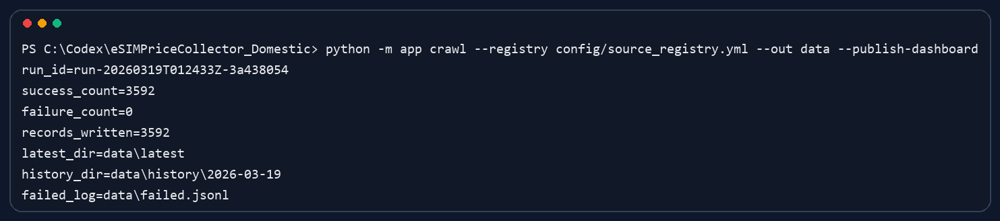
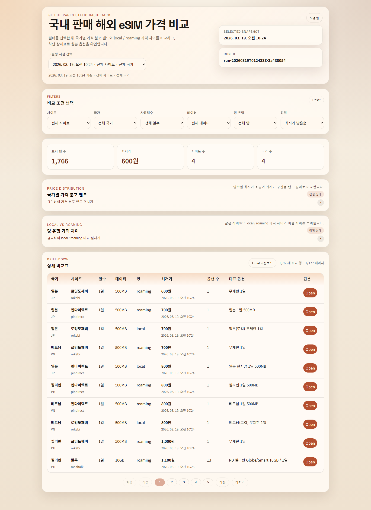
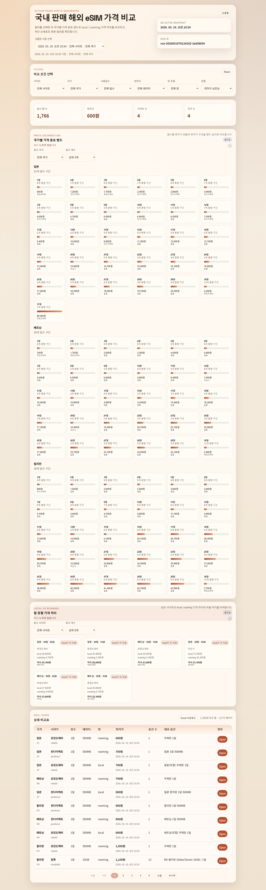

# eSIMPriceCollector_Domestic

국내 eSIM 판매 사이트의 해외 사용 상품 가격을 수집하고, 정규화된 JSON 산출물과 GitHub Pages 정적 대시보드로 비교할 수 있게 만드는 프로젝트입니다.

현재 코드는 실제 크롤링 파이프라인, 사이트별 어댑터, 이력 저장, 대시보드 publish 번들 생성까지 연결되어 있습니다.

## 한눈에 보기

- 대상 사이트: `usimsa`, `pindirect`, `rokebi`, `maaltalk`
- 대상 국가: 일본(`JP`), 베트남(`VN`), 미국(`US`), 필리핀(`PH`)
- 출력물:
  - `data/latest/records.json`
  - `data/latest/run_metadata.json`
  - `data/history/YYYY-MM-DD/records.json`
  - `data/runs/<run_id>.json`
  - `dashboard/data/latest.json`
  - `dashboard/data/index.json`
  - `dashboard/data/snapshots/<run_id>.json`
- 배포 형태: GitHub Pages 정적 대시보드
- 검증 상태: `python -m pytest -q` 기준 `21 passed`

## 주요 기능

- 사이트별 HTML / embedded payload / direct API / browser fallback 방식을 조합해 가격 데이터를 수집합니다.
- 사이트별 원본 데이터를 `NormalizedPriceRecord` 형식으로 정규화합니다.
- 최신 스냅샷과 일자별 이력을 함께 저장합니다.
- 전체 실행에서만 대시보드 publish 번들을 갱신하고, 부분 실행은 로컬 산출물만 갱신합니다.
- 대시보드에서 국가별 가격 분포, `local / roaming` 가격 차이, 상세 비교표를 확인할 수 있습니다.

## 지원 사이트와 수집 방식

| 사이트 | 코드 | 수집 방식 | 비고 |
| --- | --- | --- | --- |
| 유심사 | `usimsa` | HTML 내 `dayOptions` embedded payload 파싱 | `local`, `roaming` 동시 수집 가능 |
| 핀다이렉트 | `pindirect` | `__NEXT_DATA__`에서 `productId` 추출 후 direct API 조회, 실패 시 Playwright fallback | API 캡처 fallback 포함 |
| 로밍도깨비 | `rokebi` | HTML 내 `allProd` embedded payload 파싱 | 상품명 기준 국가/망 분류 |
| 말톡 | `maaltalk` | `goods_ps.php?mode=option_select` 우선, 실패 시 Playwright fallback | 옵션 단계별 payload 재귀 수집 |

실제 대상 URL은 [`config/source_registry.yml`](/C:/Codex/eSIMPriceCollector_Domestic/config/source_registry.yml)에서 관리합니다.

## 실행 화면

아래 이미지는 2026-03-19 전체 publish 실행 기준 예시입니다.

### 1. 크롤 실행 결과



위 실행에서는 다음 결과를 확인했습니다.

- `run_id`: `run-20260319T012433Z-3a438054`
- `records_written`: `3592`
- `failure_count`: `0`

### 2. 대시보드 첫 화면



### 3. 대시보드 상세 화면



## 설치

### 1. Python 환경 준비

- 권장 버전: Python `3.13`

### 2. 의존성 설치

이 저장소에는 별도 `requirements.txt`가 없으므로 현재 코드 기준 필요한 패키지를 직접 설치합니다.

```powershell
python -m pip install --upgrade pip
python -m pip install pytest PyYAML playwright
python -m playwright install chromium
```

`playwright`와 `chromium`은 `pindirect`, `maaltalk`의 browser fallback 경로에 필요합니다.

## 빠른 시작

### 도움말

```powershell
python -m app crawl --help
```

### 전체 크롤 실행

```powershell
python -m app crawl --registry config/source_registry.yml --out data
```

### 대시보드 publish 데이터까지 함께 갱신

```powershell
python -m app crawl --registry config/source_registry.yml --out data --publish-dashboard
```

### 특정 사이트 / 국가만 부분 실행

```powershell
python -m app crawl --registry config/source_registry.yml --out data --site usimsa --site pindirect --site rokebi --site maaltalk --country JP
```

## CLI 동작 방식

엔트리포인트는 [`app/__main__.py`](/C:/Codex/eSIMPriceCollector_Domestic/app/__main__.py), CLI 정의는 [`app/cli.py`](/C:/Codex/eSIMPriceCollector_Domestic/app/cli.py)에 있습니다.

`crawl` 명령은 다음 순서로 동작합니다.

1. [`config/source_registry.yml`](/C:/Codex/eSIMPriceCollector_Domestic/config/source_registry.yml)을 읽습니다.
2. `--site`, `--country` 필터를 적용합니다.
3. 사이트별 adapter를 호출해 원본 옵션을 수집합니다.
4. 정규화 및 검증을 수행합니다.
5. `data/latest/`, `data/history/`, `data/runs/`에 결과를 기록합니다.
6. `--publish-dashboard`가 있고 부분 실행이 아니면 `dashboard/data/` publish 번들을 갱신합니다.

종료 코드는 다음 규칙을 따릅니다.

- `0`: 전체 성공
- `2`: 일부 실패가 있었지만 산출물 생성 완료
- 그 외: 실행 실패

## 출력 구조

### 크롤 산출물

- `data/latest/records.json`: 최신 정규 레코드
- `data/latest/run_metadata.json`: 최신 실행 메타데이터
- `data/history/YYYY-MM-DD/records.json`: UTC 날짜 기준 일자별 스냅샷
- `data/runs/<run_id>.json`: 실행 단위 메타데이터
- `data/failed.jsonl`: 실패 로그 누적 파일

### 대시보드 publish 산출물

- `dashboard/data/latest.json`: 대시보드 기본 최신 데이터
- `dashboard/data/index.json`: 스냅샷 목록과 최신 `run_id`
- `dashboard/data/snapshots/<run_id>.json`: 과거 publish 스냅샷

중요한 동작 규칙:

- 전체 실행 + `--publish-dashboard`일 때만 `dashboard/data/latest.json`이 갱신됩니다.
- `--site`, `--country`가 포함된 부분 실행은 `--publish-dashboard`를 붙여도 publish 번들을 덮어쓰지 않습니다.

## 정규 레코드 핵심 필드

정규 가격 레코드는 [`app/models.py`](/C:/Codex/eSIMPriceCollector_Domestic/app/models.py)의 `NormalizedPriceRecord`를 기준으로 합니다.

- `site`
- `site_label`
- `country_code`
- `country_name_ko`
- `source_url`
- `option_name`
- `days`
- `data_quota_mb`
- `data_quota_label`
- `speed_policy`
- `network_type`
- `product_type`
- `price_krw`
- `currency`
- `availability_status`
- `collected_at`
- `parser_mode`
- `evidence`
- `raw_payload_hash`

## 대시보드 사용 방법

대시보드 소스는 [`dashboard/index.html`](/C:/Codex/eSIMPriceCollector_Domestic/dashboard/index.html), [`dashboard/app.js`](/C:/Codex/eSIMPriceCollector_Domestic/dashboard/app.js), [`dashboard/styles.css`](/C:/Codex/eSIMPriceCollector_Domestic/dashboard/styles.css)에 있습니다.

대시보드에서 볼 수 있는 핵심 화면은 다음과 같습니다.

- `비교 조건 선택`: 사이트, 국가, 사용일수, 데이터, 망 유형, 정렬 기준 필터
- `국가별 가격 분포 밴드`: 국가별 일수 구간의 최저가 흐름 비교
- `망 유형 가격 차이`: 같은 사이트의 `local / roaming` 가격 차이 비교
- `상세 비교표`: 대표 옵션, 최저가, 시점별 가격 차이, 옵션 수, 원본 링크 확인 및 CSV 다운로드
- `크롤링 시점 선택`: 기준 스냅샷 1개와 비교 스냅샷 여러 개를 선택해 시점별 가격 변화를 비교

대시보드 사용 포인트:

- 상단 `기준 시점 선택`에서 기준 스냅샷을 고르고, `비교 시점 선택`에서 여러 publish 시점을 동시에 선택할 수 있습니다.
- `상세 비교표`의 `시점 비교` 열에는 기준 시점 대비 `+/-원` 변화 또는 `비교 불가` 상태가 표시됩니다.
- `국가별 가격 분포 밴드`, `망 유형 가격 차이` 섹션에서 카드 클릭으로 drill-down 한 뒤에는 각 섹션 안의 `드릴다운 해제` 버튼으로 바로 원복할 수 있습니다.

로컬에서 대시보드를 확인하려면:

```powershell
python -m http.server 8000
```

브라우저에서 `http://127.0.0.1:8000/dashboard/`로 접속합니다.

## 테스트

### 전체 테스트

```powershell
python -m pytest -q
```

### 권장 검증 순서

1. `python -m pytest -q`
2. 부분 크롤 실행으로 실제 산출물 확인
3. 필요하면 `--publish-dashboard`로 전체 실행
4. `http.server`로 대시보드 수동 확인

수동 확인 권장 시나리오:

1. 스냅샷 2개 이상이 있는 상태에서 기준 시점 1개와 비교 시점 1개 이상을 선택한다.
2. 상세 비교표에 `시점 비교` 열이 생기고 `+/-원` 또는 `비교 불가`가 표시되는지 확인한다.
3. `국가별 가격 분포 밴드` 카드 클릭 후 섹션의 `드릴다운 해제` 버튼으로 바로 원복되는지 확인한다.
4. `망 유형 가격 차이` 카드 클릭 후 동일하게 섹션 내에서 원복되는지 확인한다.
5. Excel 다운로드 CSV에 `시점비교` 열이 포함되는지 확인한다.

## GitHub Actions 배포

워크플로는 [`collect-and-deploy.yml`](/C:/Codex/eSIMPriceCollector_Domestic/.github/workflows/collect-and-deploy.yml)에 있습니다.

- `workflow_dispatch`: 수동 실행
- `schedule`: 6시간마다 자동 실행 (`17 */6 * * *`)

워크플로 순서는 다음과 같습니다.

1. Python 3.13 환경 준비
2. `pytest`, `PyYAML`, `playwright` 설치
3. `python -m playwright install chromium`
4. `python -m app crawl --registry config/source_registry.yml --out data --publish-dashboard`
5. `python -m pytest -q`
6. `dashboard/`를 GitHub Pages artifact로 업로드
7. `data/failed.jsonl`, `data/runs/`, `data/latest/run_metadata.json`를 로그 artifact로 업로드

GitHub 저장소 설정에서 Pages source는 반드시 `GitHub Actions`여야 합니다.

## 새 사이트 추가 방법

1. [`config/source_registry.yml`](/C:/Codex/eSIMPriceCollector_Domestic/config/source_registry.yml)에 `site`, `site_label`, 국가별 `source_url`을 추가합니다.
2. [`app/adapters`](/C:/Codex/eSIMPriceCollector_Domestic/app/adapters)에 새 adapter를 만들고 `register_adapter("<site>", ...)`를 등록합니다.
3. 수집 방식이 `embedded payload`, `direct API`, `browser fallback` 중 무엇인지 명확히 정합니다.
4. `tests/fixtures/`에 최소 1개 이상의 fixture를 추가합니다.
5. `tests/test_<site>_adapter.py`를 추가해 파서와 fallback 경로를 검증합니다.
6. `python -m pytest -q`와 부분 크롤로 산출물을 확인합니다.
7. 대시보드 publish가 필요하면 전체 실행 + `--publish-dashboard`로 스냅샷을 갱신합니다.
8. 스키마 변경이 있으면 [`app/models.py`](/C:/Codex/eSIMPriceCollector_Domestic/app/models.py), README, 대시보드 소비 로직을 함께 수정합니다.

## 장애 대응 가이드

사이트 구조가 바뀌었을 때는 아래 순서를 권장합니다.

1. `data/failed.jsonl`와 `data/latest/run_metadata.json`으로 실패 대상과 시각을 확인합니다.
2. 변경된 HTML 또는 API payload를 fixture로 저장합니다.
3. 기존 fixture와 비교해 selector, JSON path, 응답 형태 변화를 찾습니다.
4. 테스트를 먼저 수정하거나 추가한 뒤 adapter를 수정합니다.
5. 부분 크롤로 복구 여부를 확인하고, 마지막에 전체 publish를 다시 실행합니다.
