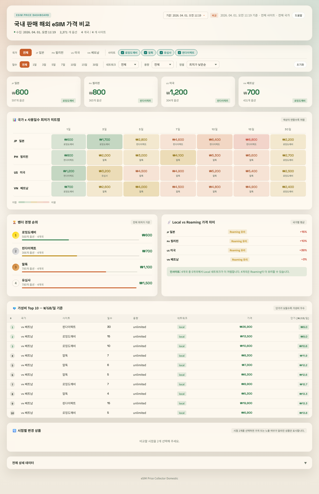

# eSIMPriceCollectorDomestic

국내 eSIM 판매 사이트의 해외 사용 상품 가격을 수집하고, 정규화된 JSON 산출물과 GitHub Pages 정적 대시보드로 비교할 수 있게 만드는 프로젝트입니다.

현재 저장소에는 실제 크롤링 파이프라인, 사이트별 어댑터, 이력 저장, 대시보드 publish 번들 생성, GitHub Actions 기반 배포 구성이 포함되어 있습니다.

## 대시보드 화면

아래 이미지는 2026-04-12 기준으로 다시 캡처한 현재 대시보드 화면입니다.



## 한눈에 보기

- 대상 사이트: `usimsa`, `pindirect`, `rokebi`, `maaltalk`
- 대상 국가: 일본(`JP`), 베트남(`VN`), 미국(`US`), 필리핀(`PH`)
- 기본 통화: `KRW`
- 배포 형태: GitHub Pages 정적 대시보드
- 체크인된 최신 publish 스냅샷: `run-20260401T021956Z-5e8221cf`
- 체크인된 최신 실행 메타데이터: `success_count=2371`, `failure_count=0`

## 주요 기능

- 사이트별 HTML, embedded payload, direct API, browser fallback 방식을 조합해 가격 데이터를 수집합니다.
- 사이트별 원본 데이터를 `NormalizedPriceRecord` 형식으로 정규화합니다.
- 최신 스냅샷과 일자별 이력을 함께 저장합니다.
- 전체 실행에서만 대시보드 publish 번들을 갱신하고, 부분 실행은 로컬 산출물만 갱신합니다.
- 대시보드에서 국가별 요약 카드, `국가 x 사용일수 최저가 히트맵`, `벤더 경쟁 순위`, `Local vs Roaming 가격 차이`, `가성비 Top 10`, `시점별 변경 상품`, `전체 상세 데이터`를 확인할 수 있습니다.

## 지원 사이트와 수집 방식

| 사이트 | 코드 | 수집 방식 | 비고 |
| --- | --- | --- | --- |
| 유심사 | `usimsa` | HTML 내 embedded payload 파싱 | `local`, `roaming` 동시 수집 가능 |
| 핀다이렉트 | `pindirect` | `__NEXT_DATA__` 기반 product 조회 후 direct API 호출, 실패 시 Playwright fallback | API 캡처 fallback 포함 |
| 로밍도깨비 | `rokebi` | HTML 내 embedded payload 파싱 | 상품명 기준 국가/망 분류 |
| 말톡 | `maaltalk` | `goods_ps.php?mode=option_select` 우선, 실패 시 Playwright fallback | 옵션 단계별 payload 재귀 수집 |

대상 URL과 국가 매핑은 [config/source_registry.yml](config/source_registry.yml)에서 관리합니다.

## 저장 산출물

크롤링 결과는 아래 경로에 기록됩니다.

- `data/latest/records.json`
- `data/latest/run_metadata.json`
- `data/history/YYYY-MM-DD/records.json`
- `data/runs/<run_id>.json`
- `data/failed.jsonl`

대시보드 publish 산출물은 아래 경로를 사용합니다.

- `dashboard/data/latest.json`
- `dashboard/data/index.json`
- `dashboard/data/snapshots/<run_id>.json`

중요한 규칙:

- 전체 실행 + `--publish-dashboard`일 때만 `dashboard/data/latest.json`이 갱신됩니다.
- `--site`, `--country`가 포함된 부분 실행은 `--publish-dashboard`를 붙여도 publish 번들을 덮어쓰지 않습니다.

## 설치

### Python 환경

- 권장 버전: Python `3.13`
- `dataclass(slots=True)`를 사용하므로 Python 3.10 이상이 필요합니다.
- GitHub Actions도 Python `3.13` 기준으로 실행됩니다.

### 의존성 설치

```powershell
python -m pip install --upgrade pip
python -m pip install pytest PyYAML playwright
python -m playwright install chromium
```

`playwright`와 `chromium`은 `pindirect`, `maaltalk`의 browser fallback 경로에 필요합니다.

## 빠른 시작

### 도움말

```powershell
python -m app crawl --help
```

### 전체 크롤 실행

```powershell
python -m app crawl --registry config/source_registry.yml --out data
```

### 대시보드 publish 데이터까지 함께 갱신

```powershell
python -m app crawl --registry config/source_registry.yml --out data --publish-dashboard
```

### 특정 사이트 또는 국가만 부분 실행

```powershell
python -m app crawl --registry config/source_registry.yml --out data --site usimsa --site pindirect --country JP
```

## CLI 동작 방식

엔트리포인트는 [app/__main__.py](app/__main__.py), CLI 정의는 [app/cli.py](app/cli.py)에 있습니다.

`crawl` 명령은 다음 순서로 동작합니다.

1. [config/source_registry.yml](config/source_registry.yml)을 읽습니다.
2. `--site`, `--country` 필터를 적용합니다.
3. 사이트별 adapter를 호출해 원본 옵션을 수집합니다.
4. 정규화 및 검증을 수행합니다.
5. `data/latest/`, `data/history/`, `data/runs/`에 결과를 기록합니다.
6. `--publish-dashboard`가 있고 부분 실행이 아니면 `dashboard/data/` publish 번들을 갱신합니다.

종료 코드는 다음 규칙을 따릅니다.

- `0`: 전체 성공
- `2`: 일부 실패가 있었지만 산출물 생성 완료
- 그 외: 실행 실패

## 정규 레코드 핵심 필드

정규 가격 레코드는 [app/models.py](app/models.py)의 `NormalizedPriceRecord`를 기준으로 합니다.

- `site`
- `site_label`
- `country_code`
- `country_name_ko`
- `source_url`
- `option_name`
- `days`
- `data_quota_mb`
- `data_quota_label`
- `speed_policy`
- `network_type`
- `product_type`
- `price_krw`
- `currency`
- `availability_status`
- `collected_at`
- `parser_mode`
- `evidence`
- `raw_payload_hash`

## 대시보드 구성

대시보드 소스는 [dashboard/index.html](dashboard/index.html), [dashboard/app.js](dashboard/app.js), [dashboard/styles.css](dashboard/styles.css)에 있습니다.

대시보드 핵심 화면:

- `비교 조건 선택`: 국가 탭, 사이트 칩, 사용일수 버튼, 네트워크/용량/정렬 드롭다운, 초기화 버튼
- `국가별 요약 카드`: 국가별 최저가, 옵션 수, 최저가 사이트 요약
- `국가 x 사용일수 최저가 히트맵`: 1·3·5·7·10·15·30일 구간의 최저가 비교
- `벤더 경쟁 순위`: 전체 최저가 기준 사이트별 순위
- `Local vs Roaming 가격 차이`: 국가별 평균 가격 차이와 인사이트 문구
- `가성비 Top 10`: `₩/GB/일` 기준 상위 옵션 비교
- `시점별 변경 상품`: 상단 시점 선택기에서 최대 2개 스냅샷을 골라 가격/노출 변화 확인
- `전체 상세 데이터`: 필터 결과 표, 페이지네이션, Excel 다운로드

로컬에서 대시보드를 확인하려면:

```powershell
python -m http.server 8000
```

브라우저에서 `http://127.0.0.1:8000/dashboard/`로 접속합니다.

참고:

- 현재 저장소에 포함된 publish 데이터 기준 최신 스냅샷은 `2026-04-01 02:19 UTC` 수집본입니다.
- 시점 비교 드롭다운은 `dashboard/data/index.json`에 포함된 스냅샷 목록을 사용합니다.

## 테스트

기본 테스트 명령:

```powershell
python -m pytest -q
```

권장 검증 순서:

1. `python -m pytest -q`
2. 부분 크롤 실행으로 실제 산출물 확인
3. 필요하면 `--publish-dashboard`로 전체 실행
4. `http.server`로 대시보드 수동 확인

참고:

- 현재 워크플로는 crawl 이후 테스트를 다시 실행합니다.
- Python 3.10 미만 환경에서는 `dataclass(slots=True)` 때문에 테스트 수집 단계에서 실패합니다.

## GitHub Actions 배포

워크플로는 [.github/workflows/collect-and-deploy.yml](.github/workflows/collect-and-deploy.yml)에 있습니다.

- `push` to `main`
- `workflow_dispatch`
- `schedule`: 6시간마다 자동 실행 (`17 */6 * * *`)

워크플로 순서:

1. Python 3.13 환경 준비
2. `pytest`, `PyYAML`, `playwright` 설치
3. `python -m playwright install chromium`
4. `python -m app crawl --registry config/source_registry.yml --out data --publish-dashboard`
5. `python -m pytest -q`
6. `dashboard/`를 GitHub Pages artifact로 업로드
7. `data/failed.jsonl`, `data/runs/`, `data/latest/run_metadata.json`를 로그 artifact로 업로드
8. GitHub Pages 배포

GitHub 저장소 설정에서 Pages source는 반드시 `GitHub Actions`여야 합니다.

## 새 사이트 추가 방법

1. [config/source_registry.yml](config/source_registry.yml)에 `site`, `site_label`, 국가별 `source_url`을 추가합니다.
2. [app/adapters](app/adapters)에 새 adapter를 만들고 `register_adapter("<site>", ...)`를 등록합니다.
3. 수집 방식이 `embedded payload`, `direct API`, `browser fallback` 중 무엇인지 명확히 정합니다.
4. `tests/fixtures/`에 최소 1개 이상의 fixture를 추가합니다.
5. `tests/test_<site>_adapter.py`를 추가해 파서와 fallback 경로를 검증합니다.
6. `python -m pytest -q`와 부분 크롤로 산출물을 확인합니다.
7. 대시보드 publish가 필요하면 전체 실행 + `--publish-dashboard`로 스냅샷을 갱신합니다.
8. 스키마 변경이 있으면 [app/models.py](app/models.py), README, 대시보드 소비 로직을 함께 수정합니다.

## 장애 대응 가이드

사이트 구조가 바뀌었을 때는 아래 순서를 권장합니다.

1. `data/failed.jsonl`와 `data/latest/run_metadata.json`으로 실패 대상과 시각을 확인합니다.
2. 변경된 HTML 또는 API payload를 fixture로 저장합니다.
3. 기존 fixture와 비교해 selector, JSON path, 응답 형태 변화를 찾습니다.
4. 테스트를 먼저 수정하거나 추가한 뒤 adapter를 수정합니다.
5. 부분 크롤로 복구 여부를 확인하고, 마지막에 전체 publish를 다시 실행합니다.
